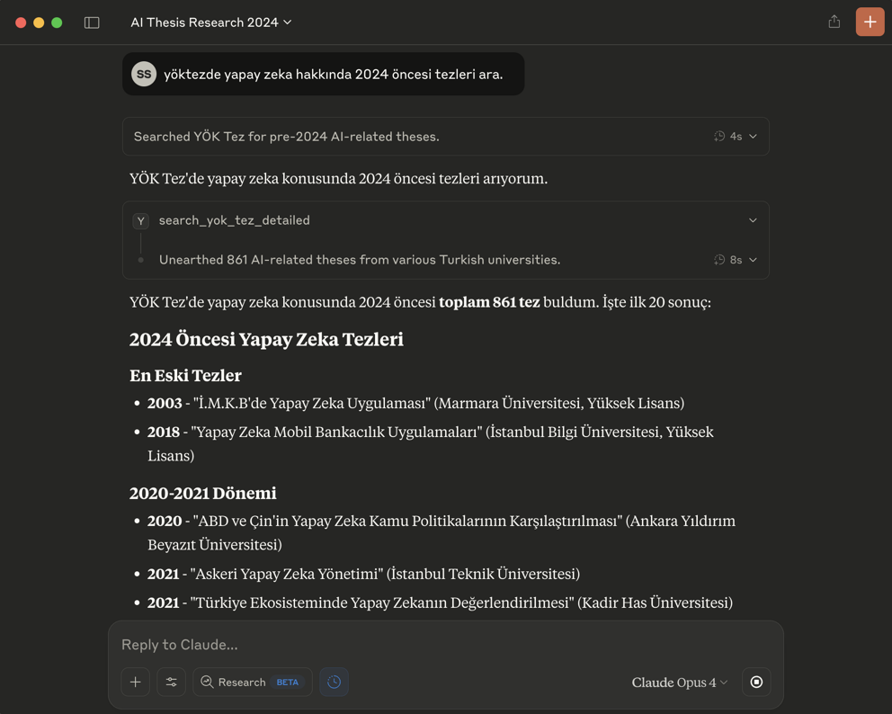

# YokTez MCP: YÖK Ulusal Tez Merkezi için MCP Sunucusu

Bu proje, Yükseköğretim Kurulu (YÖK) Ulusal Tez Merkezi'ne erişimi kolaylaştıran bir [FastMCP](https://gofastmcp.com/) sunucusu oluşturur. Bu sayede, YÖK Tez Merkezi'nden tez arama ve tezlerin PDF içeriklerini Markdown formatında getirme işlemleri, Model Context Protocol (MCP) destekleyen LLM (Büyük Dil Modeli) uygulamaları (örneğin Claude Desktop veya [5ire](https://5ire.app)) ve diğer istemciler tarafından araç (tool) olarak kullanılabilir hale gelir.

🎯 **Temel Özellikler**

* YÖK Ulusal Tez Merkezi'ne programatik erişim için standart bir MCP arayüzü.
* Aşağıdaki yetenekler:
    * **Detaylı Tez Arama:** Başlık, yazar, danışman, üniversite, enstitü, anabilim/bilim dalı, tez türü, yıl aralığı, izin durumu, tez numarası, konu, dizin ve özet metni gibi çeşitli kriterlere göre tez arama.
    * **Tez Belgesi Getirme:** Belirli bir tezin PDF içeriğini, PDF sayfa bazında, işlenmiş Markdown formatında getirme.
    * **Metadata Çıkarımı:** Tez detay sayfalarından başlık, yazar, yıl, özet gibi önemli üst verilerin çıkarılması.
    * **PDF İzin Kontrolü:** Erişilemeyen veya yayın izni olmayan tezler için uygun bildirim.
* Karar metinlerinin LLM'ler tarafından daha kolay işlenebilmesi için Markdown formatına çevrilmesi.
* Claude Desktop uygulaması ile `fastmcp install` komutu (veya manuel yapılandırma) kullanılarak kolay entegrasyon.
* YokTez MCP [5ire](https://5ire.app) gibi Claude Desktop haricindeki MCP istemcilerini de destekler.

---
🚀 **Claude Haricindeki Modellerle Kullanmak İçin Çok Kolay Kurulum (Örnek: 5ire için)**

Bu bölüm, YokTez MCP aracını 5ire gibi Claude Desktop dışındaki MCP istemcileriyle kullanmak isteyenler içindir.

* **Python Kurulumu:** Sisteminizde Python (`pyproject.toml` dosyasında belirtilen sürüm, örn: `>=3.12` veya Playwright uyumluluğu için 3.11) kurulu olmalıdır. Kurulum sırasında "**Add Python to PATH**" (Python'ı PATH'e ekle) seçeneğini işaretlemeyi unutmayın.
* **Git Kurulumu (Windows):** Bilgisayarınıza [git](https://git-scm.com/downloads/win) yazılımını indirip kurun. "Git for Windows/x64 Setup" seçeneğini indirmelisiniz.
* **`uv` Kurulumu:**
    * **Windows Kullanıcıları (PowerShell):** Bir CMD ekranı açın ve bu kodu çalıştırın: `powershell -ExecutionPolicy ByPass -c "irm https://astral.sh/uv/install.ps1 | iex"`
    * **Mac/Linux Kullanıcıları (Terminal):** Bir Terminal ekranı açın ve bu kodu çalıştırın: `curl -LsSf https://astral.sh/uv/install.sh | sh`
* **Microsoft Visual C++ Redistributable (Windows):** Bazı Python paketlerinin doğru çalışması için gereklidir. [Buradan](https://learn.microsoft.com/en-us/cpp/windows/latest-supported-vc-redist?view=msvc-170) indirip kurun.
* İşletim sisteminize uygun [5ire](https://5ire.app) MCP istemcisini indirip kurun.
* 5ire'ı açın. **Workspace -> Providers** menüsünden kullanmak istediğiniz LLM servisinin API anahtarını girin.
* **Tools** menüsüne girin. **+Local** yazan butona basın.
    * **Tool Key:** `yoktezmcp` (veya tercih ettiğiniz bir anahtar)
    * **Name:** `YokTez MCP`
    * **Command:** (`pyproject.toml` dosyanızda `[project.scripts]` altında `yoktez-mcp = "yoktez_mcp_server:main"` tanımlaması olduğunu varsayarak):
        \`\`\`
        uvx --from git+https://github.com/saidsurucu/yoktez-mcp yoktez-mcp
        \`\`\`
        Bu komut, `yoktez-mcp` paketini (ve `pyproject.toml`'de belirtilen bağımlılıklarını) belirtilen Git deposundan çekip kuracak ve tanımladığınız `yoktez-mcp` script'ini çalıştıracaktır.
    * **Save** butonuna basarak kaydedin.

*(Kendi 5ire ayar görselinizle değiştirin)*

* Şimdi **Tools** altında **YokTez MCP**'yi görüyor olmalısınız. Etkinleştirin (yeşil ışık yanmalı).
* Artık YokTez MCP ile konuşabilirsiniz.

---
⚙️ **Claude Desktop Manuel Kurulumu**

1.  **Ön Gereksinimler:** Python, `uv`, (Windows için) Microsoft Visual C++ Redistributable ve Playwright tarayıcılarının sisteminizde kurulu olduğundan emin olun. Detaylı bilgi için yukarıdaki "5ire için Kurulum" bölümündeki ilgili adımlara bakabilirsiniz.
2.  Claude Desktop **Settings -> Developer -> Edit Config**.
3.  Açılan `claude_desktop_config.json` dosyasına `mcpServers` altına ekleyin:

    \`\`\`json
    {
      "mcpServers": {
        // ... (varsa diğer sunucularınız) ...
        "YokTez MCP": {
          "command": "uvx",
          "args": [
            "--from", "git+https://github.com/saidsurucu/yoktez-mcp",
            "yoktez-mcp"
          ]
        }
      }
    }
    \`\`\`

4.  Claude Desktop'ı kapatıp yeniden başlatın.

🛠️ **Kullanılabilir Araçlar (MCP Tools)**

Bu FastMCP sunucusu LLM modelleri için aşağıdaki araçları sunar:

* **`search_yok_tez_detailed`**: YÖK Ulusal Tez Merkezi'nde çeşitli detaylı kriterleri kullanarak tez araması yapar.
    * **Parametreler**: `tez_ad`, `yazar_ad_soyad`, `danisman_ad_soyad`, `universite_ad`, `enstitu_ad`, `anabilim_dal_ad`, `bilim_dal_ad`, `tez_no`, `konu_basliklari`, `dizin_terimleri`, `ozet_metni`, `tez_turu`, `izin_durumu`, `tez_durumu`, `dil`, `enstitu_grubu`, `yil_baslangic`, `yil_bitis`, `page`, `results_per_page`.
    * **Döndürdüğü Değer**: `YokTezSearchResult` (sayfalanmış tez özeti listesi, toplam sonuç sayısı vb. içerir)

* **`get_yok_tez_document_markdown`**: Belirli bir YÖK tezinin PDF içeriğini, istenen PDF sayfasına göre Markdown formatında getirir.
    * **Parametreler**: `detail_page_url` (tez detay sayfası URL'si), `page_number` (istenen PDF sayfa numarası).
    * **Döndürdüğü Değer**: `YokTezDocumentMarkdown` (sayfanın Markdown içeriği, toplam sayfa sayısı, metadata vb. içerir)

📜 **Lisans**

Bu proje MIT Lisansı altında lisanslanmıştır. Detaylar için `LICENSE` dosyasına bakınız.